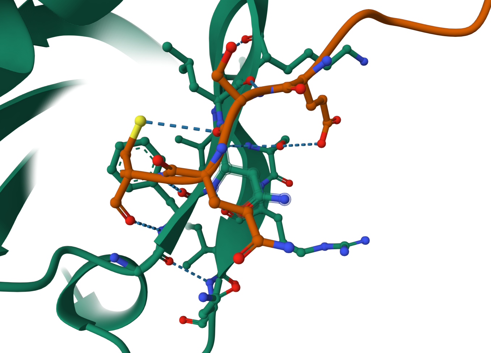
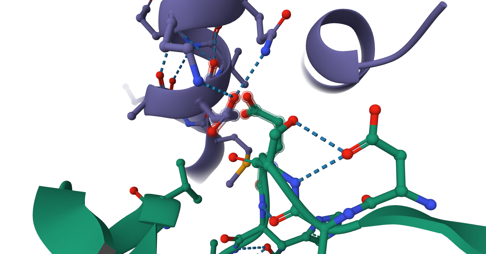
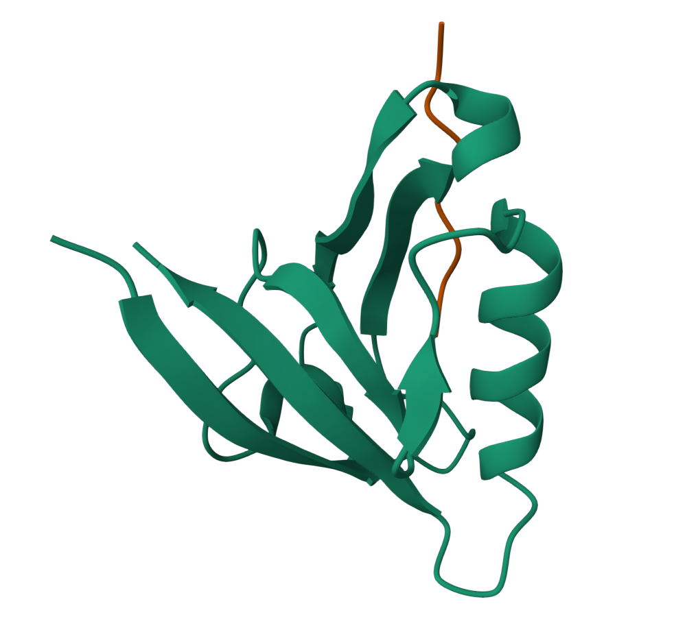

# MEGA-Fold蛋白质预测工具
## 项目介绍
使用计算机高效计算获取蛋白质空间结构的过程被称为蛋白质结构预测。传统的结构预测工具一直存在精度不足的问题，直到2020年谷歌DeepMind团队提出了AlphaFold2。相比传统工具，AlphaFold2的预测精度显著提高，所得结构与真实结构的误差接近实验方法。然而，该模型仍存在数据前处理耗时过长、缺少多序列比对（MSA）时预测精度不高、缺乏通用评估结构质量工具等问题。为了解决这些问题，高毅勤老师团队与MindSpore科学计算团队合作进行了一系列创新研究，开发出更准确和更高效的蛋白质结构预测工程MEGA-Protein。其中，MEGA-Protein中的MEGA-Fold工具在预测蛋白质结构方面表现尤为出色。我们使用该工具在MSA检索给定的蛋白质序列基础上进行了几组蛋白质结构预测。

## 环境配置
本项目基于华为云ModelArts服务进行配置，使用Notebook进行开发。

1. 准备Notebook开发环境，初始镜像选择官方提供的`mindspore1.7.0-cuda10.1-py3.7-ubuntu18.04`
2. 选择需要的GPU配置，本项目采用的是`GPU: 1*Vnt1(32GB)|CPU: 8核 64GB`
3. 环境配置好之后，将华为MindSpore升级到2.2.14版本，并安装MindSponge1.0.0rc2版本，分别根据下面两个链接教程进行安装[MindSpore](https://www.mindspore.cn/install/),[MindSponge](https://www.mindspore.cn/mindsponge/docs/zh-CN/master/index.html)

选择上述配置的原因是由于MindSponge需要MindSpore 2.0版本以上，MindSpore安装只支持cuda10.1，11.1和11.6， 我们使用多种官方镜像进行配置之后发现使用上述推荐的镜像最为便捷。

## 配置数据库检索
蛋白质结构预测工具MEGA-Fold依赖多序列比对(MSA，multiple sequence alignments)与模板检索生成等传统数据库搜索工具提供的共进化与模板信息。

- 配置MSA检索

    首先安装MSA搜索工具**MMseqs2**，该工具的安装和使用可以参考[MMseqs2 User Guide](https://mmseqs.com/latest/userguide.pdf)，安装完成后运行以下命令配置环境变量：

    ``` shell
    export PATH=$(pwd)/mmseqs/bin/:$PATH
    ```

    然后下载MSA所需数据库：

    - [uniref30_2103](http://wwwuser.gwdg.de/~compbiol/colabfold/uniref30_2103.tar.gz)：压缩包68G，解压后375G
    - [colabfold_envdb_202108](http://wwwuser.gwdg.de/~compbiol/colabfold/colabfold_envdb_202108.tar.gz)：压缩包110G，解压后949G

    下载完成后需解压并使用MMseqs2处理数据库，数据处理参考[colabfold](http://colabfold.mmseqs.com)，主要命令如下：

    ``` bash
    tar xzvf "uniref30_2103.tar.gz"
    mmseqs tsv2exprofiledb "uniref30_2103" "uniref30_2103_db"
    mmseqs createindex "uniref30_2103_db" tmp1 --remove-tmp-files 1

    tar xzvf "colabfold_envdb_202108.tar.gz"
    mmseqs tsv2exprofiledb "colabfold_envdb_202108" "colabfold_envdb_202108_db"
    mmseqs createindex "colabfold_envdb_202108_db" tmp2 --remove-tmp-files 1
    ```
- 配置模板检索

    首先安装模板搜索工具[**HHsearch**](https://github.com/soedinglab/hh-suite)
    与[**kalign**](https://msa.sbc.su.se/downloads/kalign/current.tar.gz)，然后下载模板检索所需数据库：

    - [pdb70](http://wwwuser.gwdg.de/~compbiol/data/hhsuite/databases/hhsuite_dbs/old-releases/pdb70_from_mmcif_200401.tar.gz)：压缩包19G，解压后56G
    - [mmcif database](https://ftp.rcsb.org/pub/pdb/data/structures/divided/mmCIF/)： 零散压缩文件50G，解压后200G
    - [obsolete_pdbs](http://ftp.wwpdb.org/pub/pdb/data/status/obsolete.dat)：140K
    - 配置数据库检索config

    根据数据库安装情况配置`config/data.yaml`中数据库搜索的相关配置`database_search`，相关参数含义如下：

    ```bash
    # configuration for template search
    hhsearch_binary_path   HHsearch可执行文件路径
    kalign_binary_path     kalign可执行文件路径
    pdb70_database_path    {pdb70文件夹}/pdb70
    mmcif_dir              mmcif文件夹
    obsolete_pdbs_path     PDB IDs的映射文件路径
    max_template_date      模板搜索截止时间，该时间点之后的模板会被过滤掉，默认值"2100-01-01"
    # configuration for Multiple Sequence Alignment
    mmseqs_binary          MMseqs2可执行文件路径
    uniref30_path          {uniref30文件夹}/uniref30_2103_db
    database_envdb_dir     {colabfold_envdb文件夹}/colabfold_envdb_202108_db
    a3m_result_path        mmseqs2检索结果(msa)的保存路径，默认值"./a3m_result/"
    ```
## MEGA-Fold蛋白质结构预测模型训练
由于MEGA-Fold训练数据集较大（25T硬盘空间），存储资源有限，并且训练时间过长，我们直接使用官方训练好的模型权重[MEGA_Fold_1.ckpt](https://download.mindspore.cn/mindscience/mindsponge/MEGAFold/checkpoint/MEGA_Fold_1.ckpt)
## MEGA-Fold蛋白质结构预测推理过程
使用搜索后所得的pickle文件作为输入，执行如下蛋白质结构预测代码
```python
import pickle
import mindspore as ms
from mindsponge import PipeLine
ms.set_context(mode=ms.GRAPH_MODE)

with open("./test.pkl", "rb") as f:
    feature = pickle.load(f)
fold_prediction = PipeLine(name="MEGAFold")
fold_prediction.set_device_id(0)
fold_prediction.initialize(key="predict_256")
fold_prediction.model.from_pretrained()
res = fold_prediction.predict(feature)
pdb_file = res[-1]
os.makedirs(f'res.pdb', exist_ok=True)
os_flags = os.O_RDWR | os.O_CREAT
os_modes = stat.S_IRWXU
pdb_path = './res.pdb'
with os.fdopen(os.open(pdb_path, os_flags, os_modes), 'w') as fout:
    fout.write(pdb_file)

print(protein_structure)
```
其中PipeLine中集成了官方蛋白质结构推理模型
## 蛋白质结构预测结果
我们使用三组MSA预测蛋白质序列数据，通过训练好的模型进行蛋白质结构预测，得到的可视化结果如下图所示

<div align=center>

</div>
<div align=center>

</div>
<div align=center>

</div>
通过原项目提供的预测工具计算可得，模型运算得到的置信度均达到90%以上，预测结果较为准确